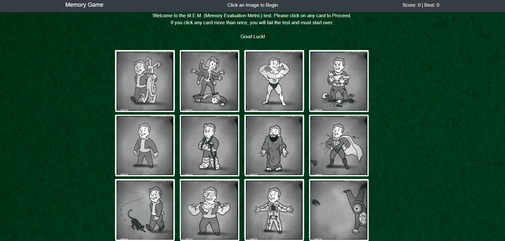

# React-Memory-Test
React Memory Test is a memory game built 

# Link to Deployed Site
[M.E.M Test](https://aehaq.github.io/React-Memory-Test/)

# Images


# Technology Used
- React.js
- JSX
- GitHub Pages

# Code Snippets
```JSX

handleClick = id => {
    const chosen = this.state.options.find(item =>item.id === id)

    // If the chosen item had already been clicked 
    if (chosen.clicked === true) {

        // Reset Score
        this.setState({ 
        score: 0,
        result: "Wrong! Game Reset. Try Again.",
        options: this.state.options.map( (item) => item.clicked = false)
        })

        // Randomize the array order again
        this.randomizeOrder()

    // If it hasn't been clicked
    } else {

        // Check if this click wins the game
        if (this.state.score === 11) {

            // Reset Game, and set high Score to 12
            this.setState({ 
                score: 0, 
                topScore: 12, 
                result: "Congratulations! You Won! \n Feel free to play again.", 
                options: this.state.options.map( (item) => item.clicked = false )
            })

        // If this click does not win the game
        } else {

            // Increment Score and print new message
            chosen.clicked = true;
            this.setState({ 
                score: this.state.score + 1,
                result: "Choose another unique image..."
            })

            // Increment Top Score if Score would be higher
            if (this.state.score >= this.state.topScore) {

                this.setState({topScore: this.state.topScore + 1})
            }
        }
        // Shuffle the Array
        this.randomizeOrder()
    }
}
```
The Code above is the function that is called when one of the images is clicked. Most of this logic within this function falls under one of two categories: Either verifying the current state of the app, or making a change to the current state of the app. 

The State has five key-value pairs which are used to run the game, and the options key corresponds to the array containing the objects for each image card used in the memory game. The first the code does is take the data associated with the element clicked on the dom, and use it to find the relevent card stored within the array. Once we have it as a variable, we are able to check whether or not it has been clicked, and change that state accordingly.

Aside from whether or not the image in question has been clicked before, this logic also keeps track of the scores, and sends different game messages to indicate your current performance in the game.

# Learning Points
- Setting up and dploying react apps
- Using JSX to insert variables into html
- Using set state
- Following React MVC
- Components for React

# Author 
Azfar Haq - [GitHub](https://github.com/aehaq)

# License
Standard MIT License